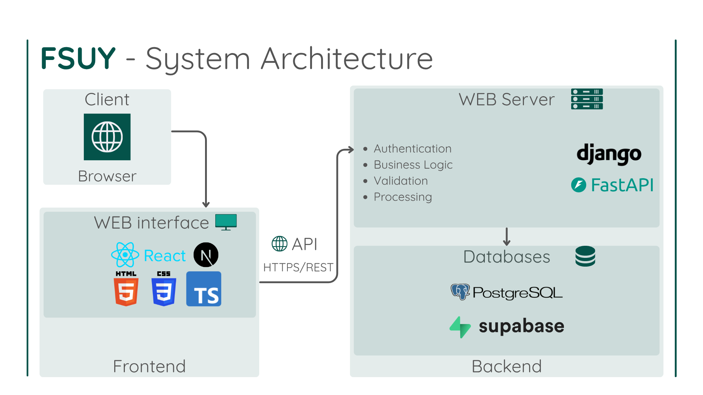
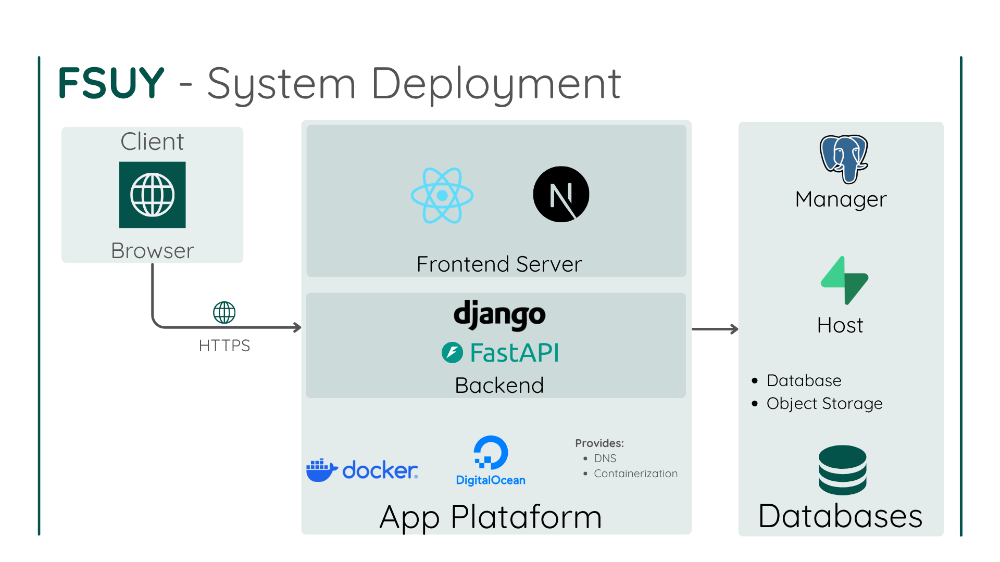

# FSUY

Será um sistema WEB de blog de análise de video-jogos.
Nele, os usuários poderão:
- Visualização e cadasto de reviews de jogos.
- Comentar e avaliar reviews de outros usuários.


Contexto do projeto: Trabalho prático da disciplina de BCC481 (Programação WEB) no período de 26.1, DECOM, UFOP.


### Contribuidores

- Hebert Luiz Madeira Pascoal ([HexagonalUniverse](github.com/HexagonalUniverse))
- Victor Xavier Costa ([victorxaviercosta](github.com/victorxaviercosta))


## Funcionalidades (implementadas)

- Cadastro e autenticação de usuários;
- Publicação de reviews de jogos;
- Visualização de reviews da comunidade;
- Comentários em reviews;
- Catálogo de jogos;
- Perfis de usuários.


## Organização do sistema

O backend disponibiliza uma API REST responsável por:

- autenticação;
- gerenciamento de usuários;
- gerenciamento de jogos;
- gerenciamento de reviews;
- comentários;
- recomendações.

O frontend consome essa API para apresentar todas as funcionalidades da aplicação.


## Documentação

A documentação do projeto encontra-se em:

```
.docs/
```

Incluindo:

- arquitetura do sistema;
- diagramas de implantação;
- diagrama entidade-relacionamento do banco de dados.


---


## Estrutura do projeto

```
src/
├── backend/
│   ├── fsuy_django/
│   └── fsuy_site/
│
└── frontend/
    └── fsuy_site/

.docs/
dependencies/
scripts/
```


---

## Arquitetura

Veja [Arquitetura do Sistema](./.docs/arquitetura.md).

Em suma:
O sistema é dividido em três módulos principais:

- **Frontend:** interface web desenvolvida com React/Next.js.
- **Backend:** API REST desenvolvida em Django.
- **Banco de dados:** PostgreSQL hospedado via Supabase.


<figure>
    
    <figcaption> <strong>Figura 1:</strong> Arquitetura geral do sistema. </figcaption>
</figure>

<figure>
    
    <figcaption> <strong>Figura 2:</strong> Arquitetura de Deployment do sistema. </figcaption>
</figure>

---

## Tecnologias

### Frontend


### Backend


Além:
- Django REST Framework
- WhiteNoise
- django-cors-headers
- django-storages

### Banco de Dados


### Infraestrutura


---

## Instalação

### Clonar o repositório

```bash
git clone https://github.com/HexagonalUniverse/fsuy.git
cd fsuy
```

---

## Backend

Primeiramente, crie um ambiente virtual python.

```bash
python -m venv .venv
```

`python3` se em sistemas Linux.
Nesse caso,

```bash
source .venv/bin/activate
```

No Windows:
```powershell
.venv\Scripts\activate
```

Instalar as dependências:

```bash
pip install -r dependencies/python.txt
```

Executar as migrações:

```bash
python manage.py migrate
```

Iniciar o servidor:

```bash
python manage.py runserver
```

Depois, é suficiente ter o docker ativo e rodar
```bash
./scripts/up.ps1
```

Ou então, diretamente,
```bash
python -m uvicorn --host 0.0.0.0 main:app --app-dir src/backend --port 4817
```

---

## Frontend

Instale as dependências:

```bash
npm --prefix src/frontend/fsuy_site install
```

Depois, execute, simultaneamente, o servidor de frontend no modo de desenvolvimento:

```bash
npm --prefix src/frontend/fsuy_site run dev 
```


---

## Licença

Este projeto está licenciado sob a licença presente no arquivo `LICENSE`.
